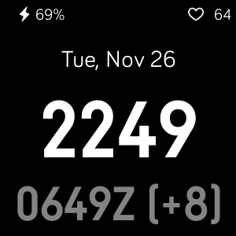
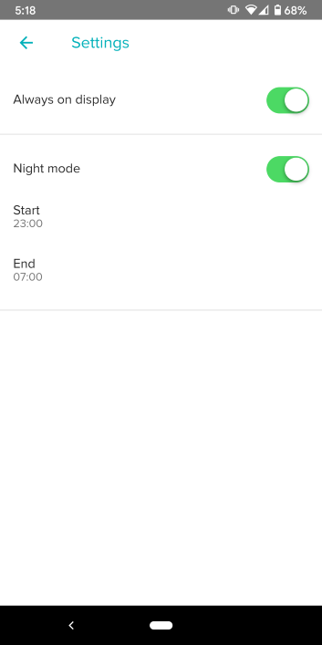

# Simple Zulu Clock watchface for Fitbit smartwatches
I needed a simple watchface that would display both the current time and the Zulu (UTC) time.
Also wanted an always on display because that's what I was used to with my Pebble (RIP).

I couldn't find a watchface that checked all the boxes, so I made one!

This is what it looks like on the Versa 2.

You can also configure always on mode as well as a night mode when the always on is disabled.

